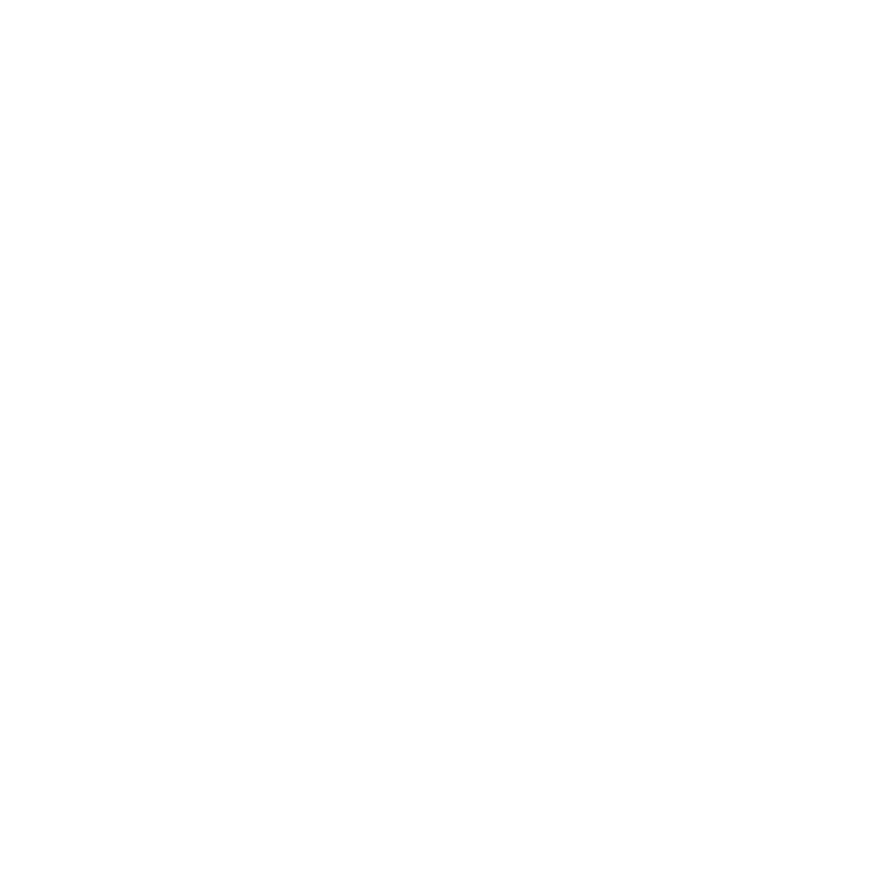
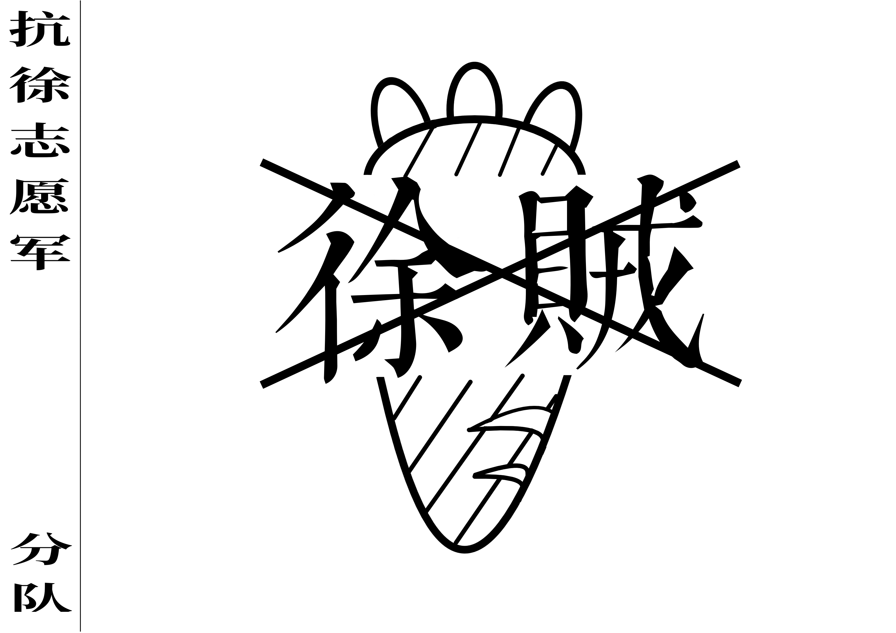

# 班长作品：三

本分类主要是抗徐旗相关内容。抗徐旗是由上文提及的徐贼叉文化衍生而来，因此主体部分也是徐贼叉，主要用于惹怒徐贼使其失去理智（不是）。

## 1. 徐贼叉旗帜

这是新版的徐贼叉旗帜（黑色前景色）。

这是白色前景色的版本。

将以上两个文件的链接后缀改为 .kra，即可下载 Krita 格式的源文件。

## 2. 写满徐贼叉的文档

[DOCX](../../dataset/banzhang/xzx-flag/徐贼叉.docx)

[PDF](../../dataset/banzhang/xzx-flag/徐贼叉.pdf)

## 3. 其他

大小适用于 MiBand 8 Pro 表盘的背景[源文件](../../dataset/banzhang/xzx-flag/xzx-flag_mb8p.kra)，但是表盘文件不知道去哪里了。

旧版的抗徐旗和源文件，有白色背景，打印下来可以填写信息，直接拿出去挥舞，记得拍个照片右键发给我，我会很感谢你的！

[KRA](../../dataset/banzhang/xzx-flag/抗徐旗.kra)
