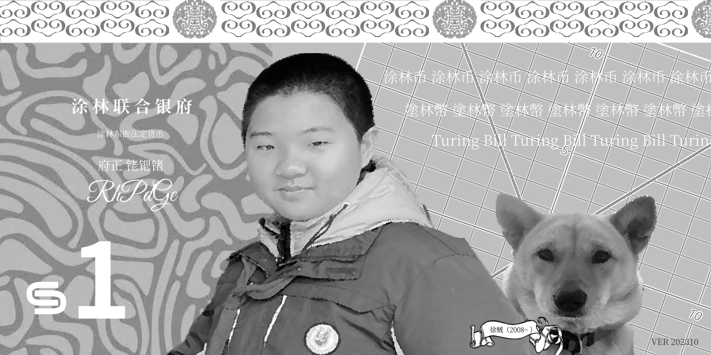

# 二




这是班长用 Krita 为涂林设计的第二版涂林币。

本版本采用开放式设计，将徐贼的头像改为更加协调的半身像，并使用了真正的大黄狗照片（即中华田园犬）。徐贼背后是 $|x|=|y|$ 的图像，实际上就是一个叉。

左侧的纹样采用 Xfce 默认桌面之一的图案，上下缘保留了第一版的设计。

这个版本的缺点主要是纸币整张几乎都是有色的，导致墨粉哗啦啦地用，彻底抵消了因为优化排版而省下的成本。

除输出图片外，还有源文件可供下载。请根据如下目录结构修改地址：

```
https://tulin.netlify.app/dataset/banzhang/v2/
添加： 
|- in
  |- 无数字模板.kra
|- out
  |- 图片
    |- ... 即上方图片
  |- 打印稿
    |- {1, 2, 5, 10, 20, 50, 100}.pdf
```
