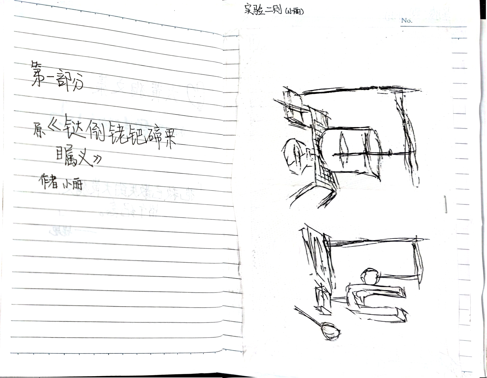
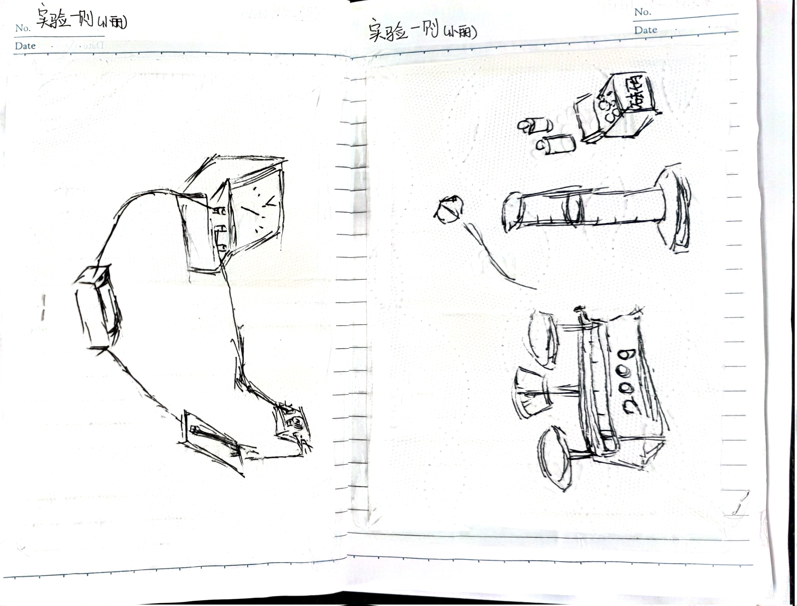
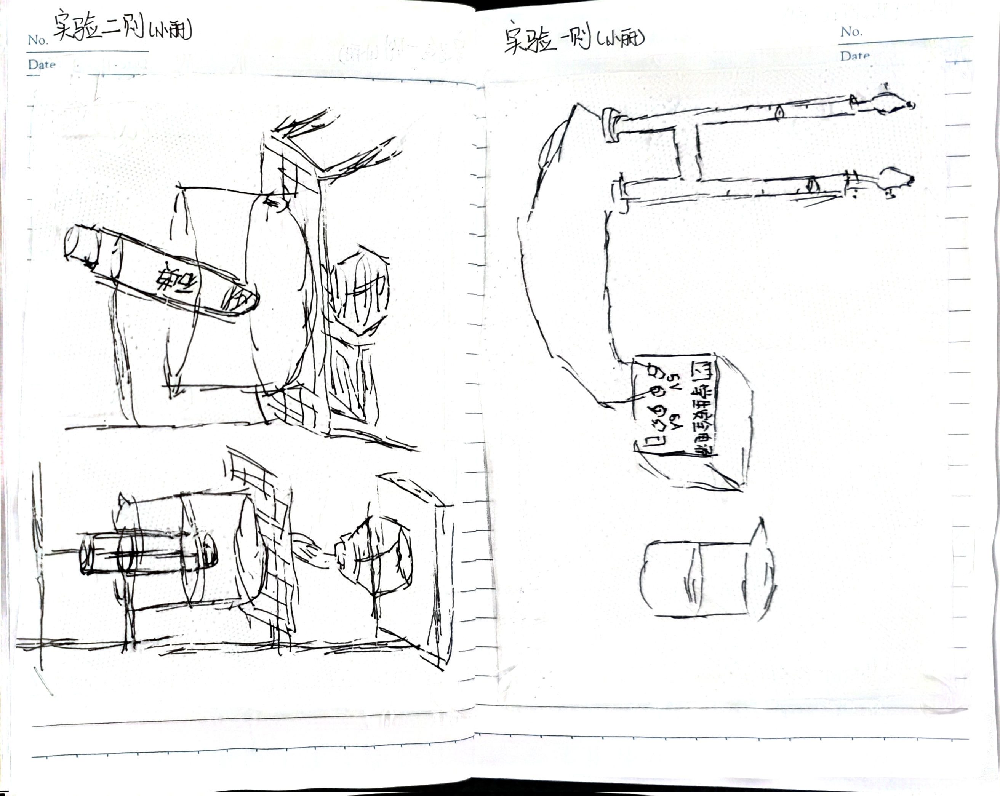
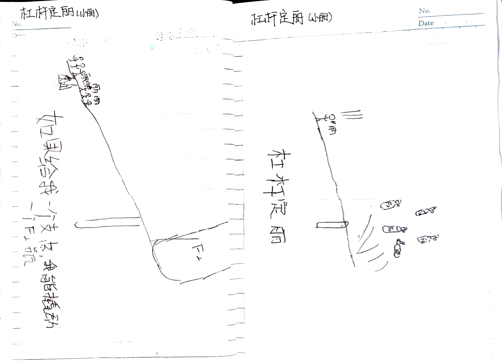
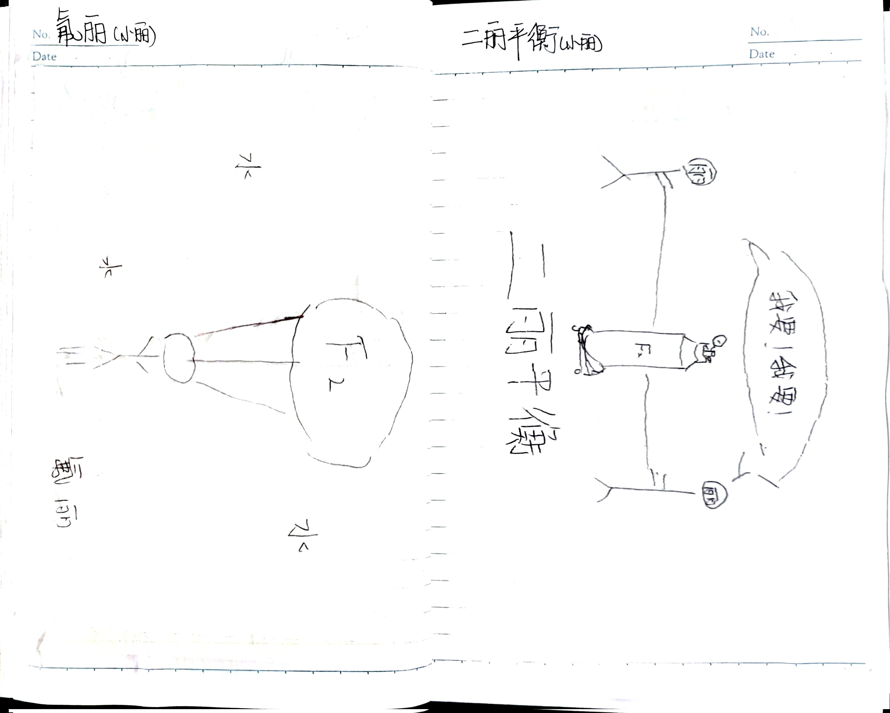
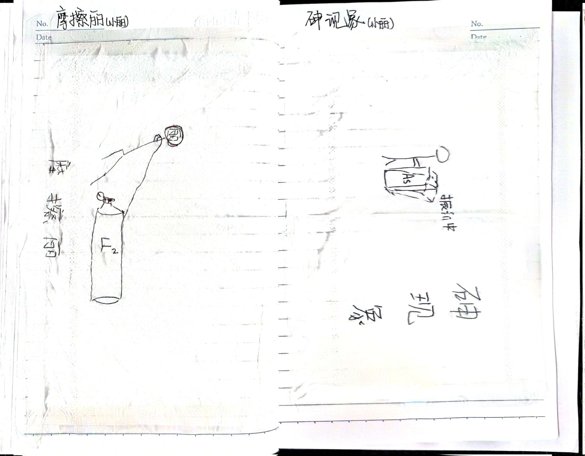

# 1️⃣ 一

好的那么从这个部分开始，我们要真正地进行丽谱了。毕竟小丽就是丽谱的定义嘛！[^1]

这张图片是小丽的绘画作品。本作品描绘了小丽进行实验的场景。

下面部分图片也是实验的绘画，就不一一说明了，相信任何一位有初中文化水平的同学都知道这是什么。

右侧的实验，描绘了测量物体密度的经典错误：将物块直接砸入量筒中。

这两则实验绘画是小丽早期的丽谱事件，也就是用杠杆[^2]将包括橡皮、剪刀、文具盒、电池、氢氧化钠、硫酸等等物体向其他地方发射。图片中描绘的是氟气瓶。

> 为什么是[氟气](https://zh.wikipedia.org/zh-cn/%E6%B0%9F%E6%B0%94)？因为氟单质非常活泼，能与几乎所有物质剧烈反应放热，小丽曾经说过：  
*世界上只有两种物质不与氟气发生反应[^3]：一种是[聚四氟乙烯](https://zh.wikipedia.org/zh-cn/%E8%81%9A%E5%9B%9B%E6%B0%9F%E4%B9%99%E7%83%AF)，另一种是其他的氟气。*

依然是物理实验，依然有氟气的参与。

左侧是拖动氟气瓶，不必多说；右侧是声现象的丽化，变为砷现象。

> 为什么又是[砷](https://zh.wikipedia.org/zh-cn/%E7%A0%B7)？大家肯定都知道砷有毒（无论是单质还是大部分化合物），姚姐非常喜欢砷，常说：  
*Arsenic!*

[^1]: 关于丽谱的严格定义，请参见[总览](../index.md)页面。

[^2]: 没有实验专用杠杆，用的是直尺和橡皮。

[^3]: 这里只是开玩笑，不与氟气反应的物质很多的，比如小丽。
