# 2️⃣ 二

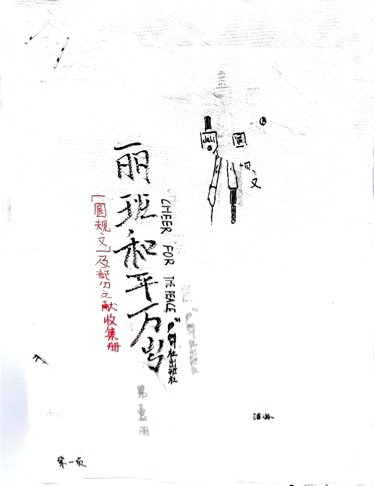

现在我们进入了圆规文的领域。这是《丽班和平万岁——「圆规文」及部分文献收藏集》的封面。

> 圆规文是什么？有一段事件小丽坐在班长前面，由于小丽过于丽谱，班长经常以用圆规戳小丽为要挟让他不要太丽谱。最后达成协议：小丽写圆规文（即丽谱的文章），班长不再戳小丽。这一协议在下面有图片。

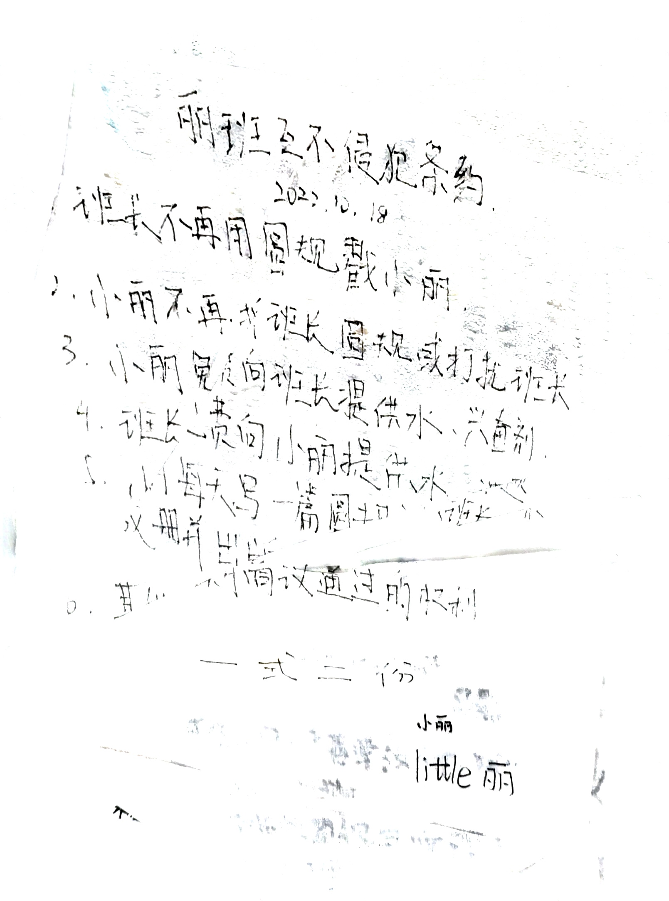

这是上文所说的《丽班互不侵犯条约》。这是开的《苏德互不侵犯条约》的玩笑，当然这个条约的最终结果也差不多。

由于条约一式两份，为了方便，小丽用钢笔在餐巾纸上写内容，然后撕成两层，因此图像质量非常糟糕，敬请认真阅读。

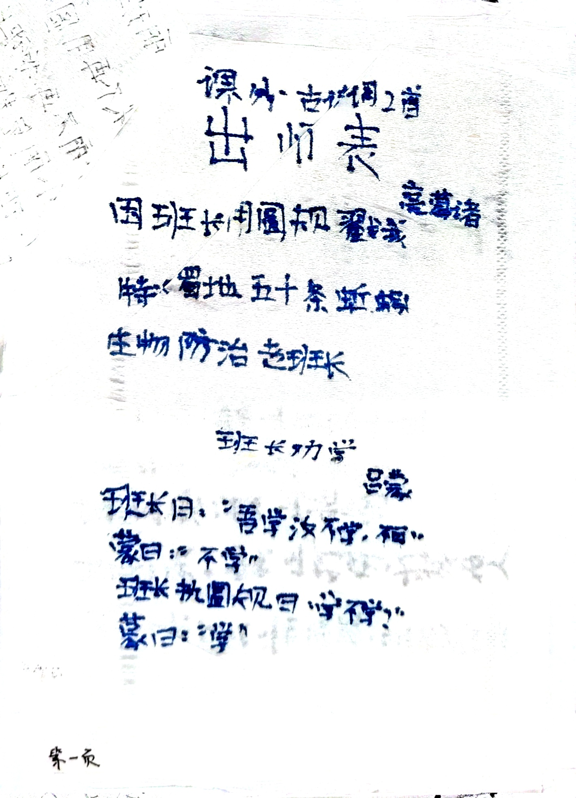

这是小丽的圆规文，用《出师表》和《孙权劝学》为基础改写，应该很容易就可以看懂，除了……

> 为什么是蚯蚓？纯属几次机缘巧合。生物课上老师说蚯蚓吃树叶；小丽踩树叶，说这是班长。所以就变成了「蚯蚓吃班长」。

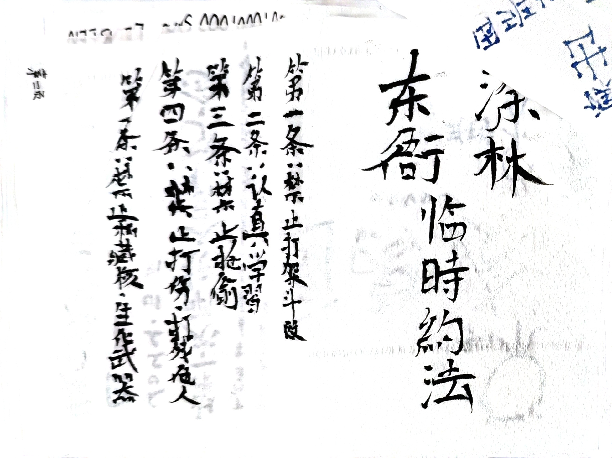

这是小丽拟写的《涂林东衙临时约法》，在标题上仿照[《中华民国临时约法》](https://zh.wikipedia.org/zh-cn/%E4%B8%AD%E8%8F%AF%E6%B0%91%E5%9C%8B%E8%87%A8%E6%99%82%E7%B4%84%E6%B3%95)。

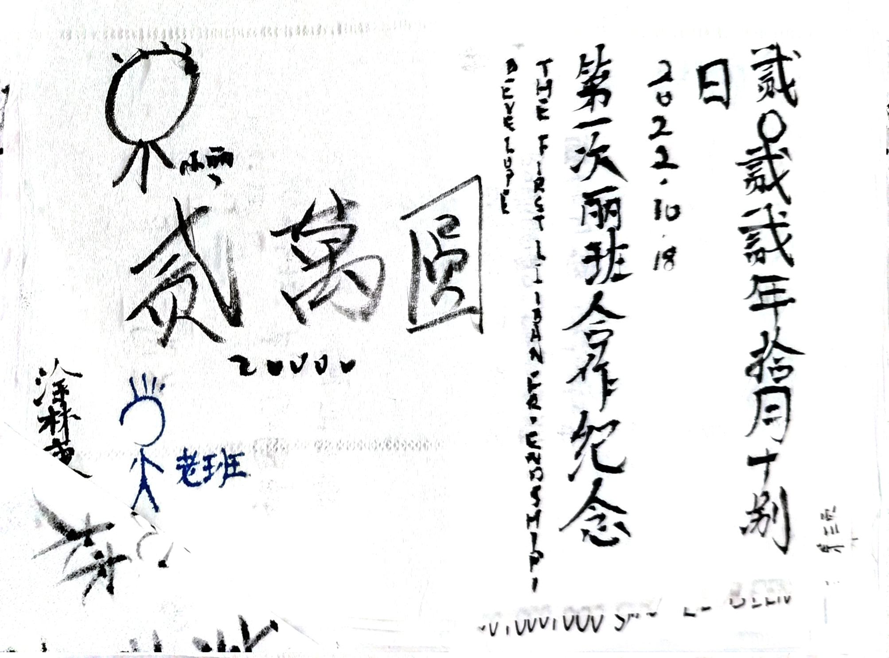

这是小丽画的（理论上来说是第一版）涂林币，纪念丽班合作，不过不久后就破裂了……

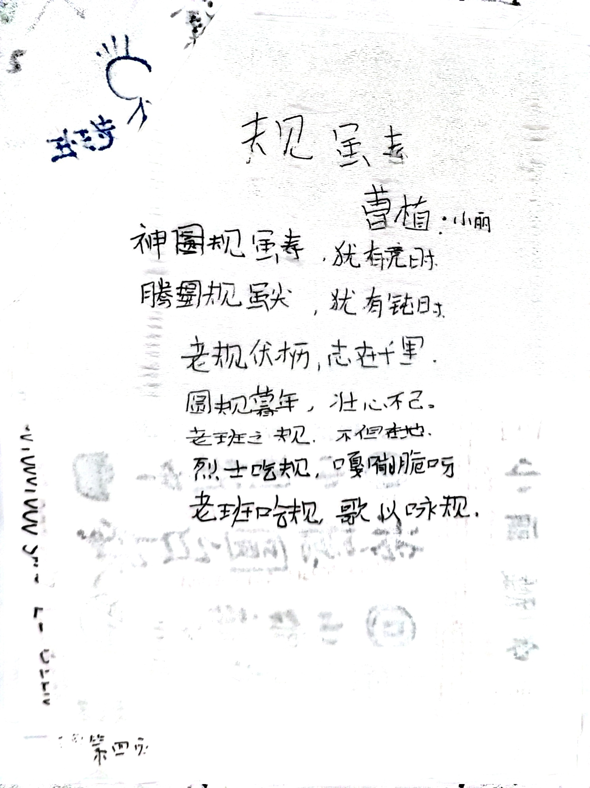

这是小丽仿照[《龟虽寿》](https://zh.wikipedia.org/zh-cn/%E9%BE%9C%E9%9B%96%E5%A3%BD)写的《规虽寿》，纯属玩笑。

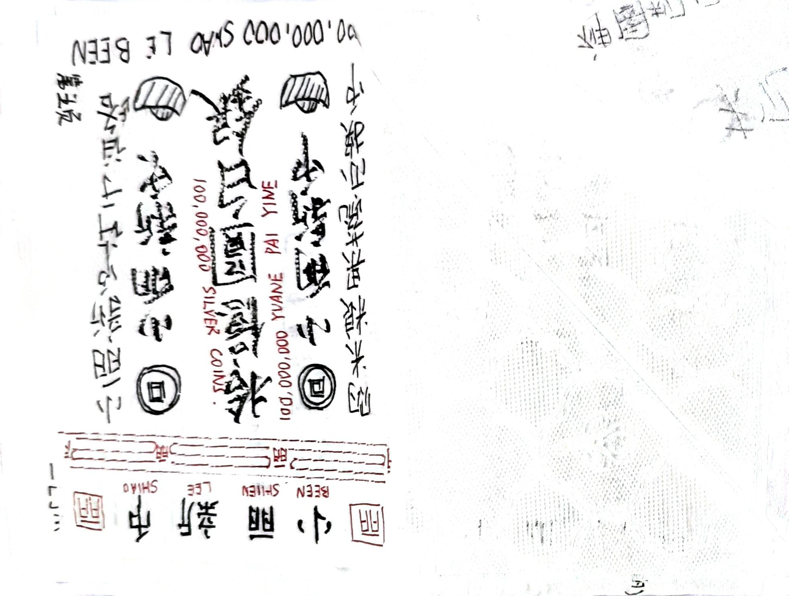

这是班长根据南宋[交子](https://zh.wikipedia.org/zh-cn/%E4%BA%A4%E5%AD%90)图片绘制的「小丽新币」。与上面提到的一样，也是为了纪念丽班合作。

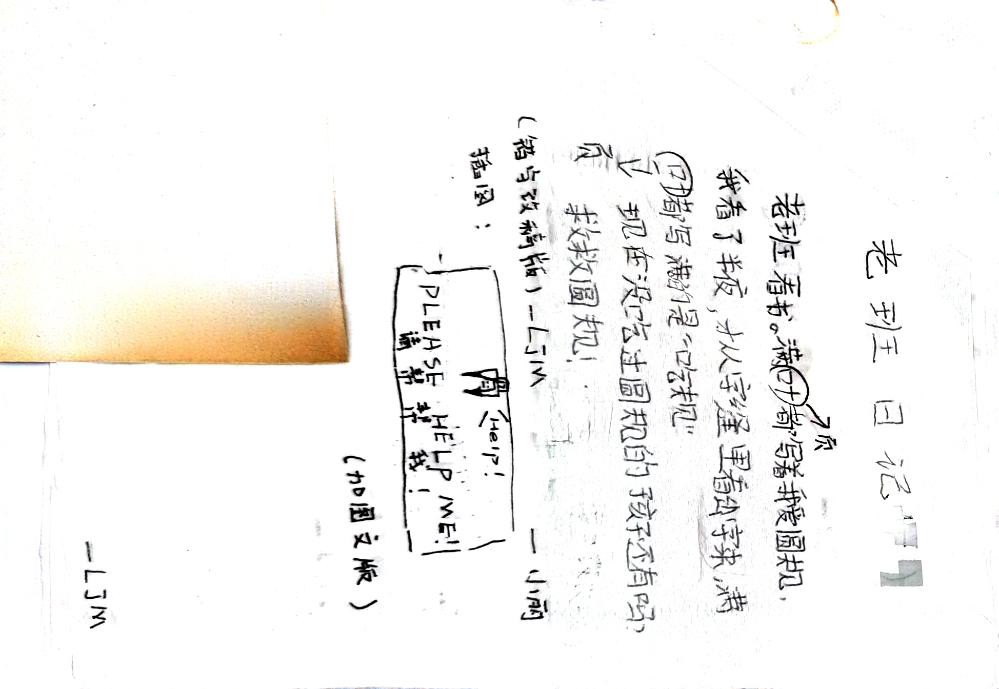

小丽根据[《狂人日记》](https://zh.wikipedia.org/zh-cn/%E7%8B%82%E4%BA%BA%E6%97%A5%E8%AE%B0)改写了《老班日记》，将叙事的重点放在了圆规上，也算是呼应了这些文章的类型：圆规文。下面的配图和错字修改[^1]是雷总所做。

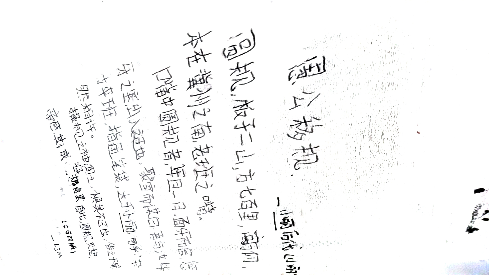

小丽根据[《愚公移山》](https://zh.wikipedia.org/zh-cn/%E6%84%9A%E5%85%AC%E7%A7%BB%E5%B1%B1)改写的《愚公移规》，仅仅是一个玩笑，貌似没有深层含义。

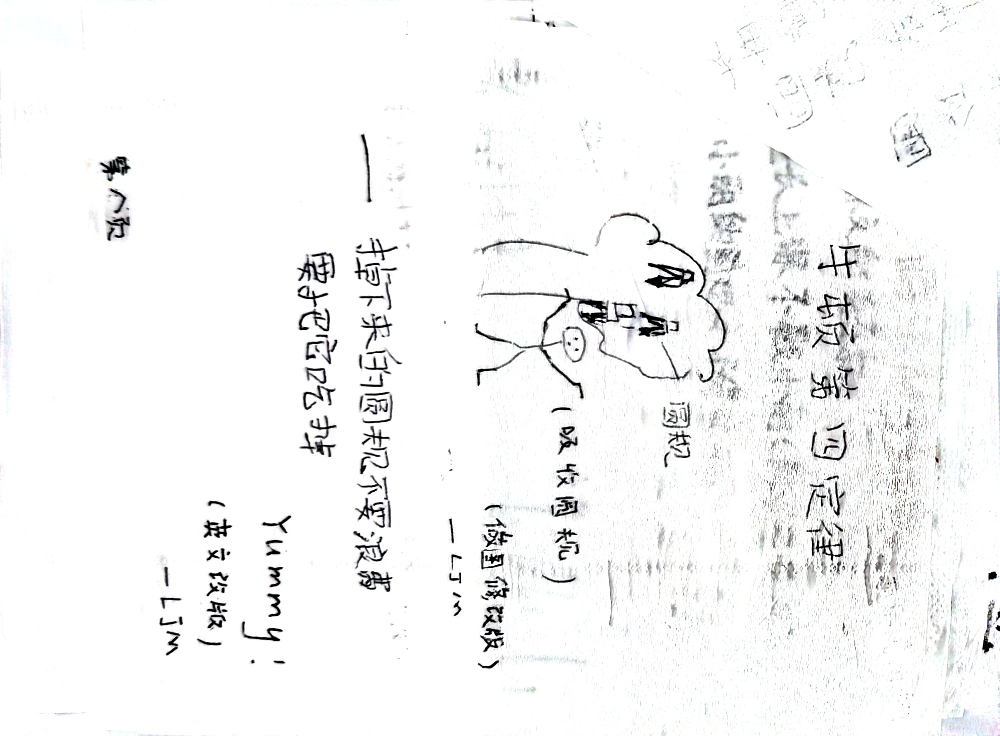

小丽自创的牛顿第四定律，事实上他确实吃过圆规[^2]。雷总进行了部分修改。

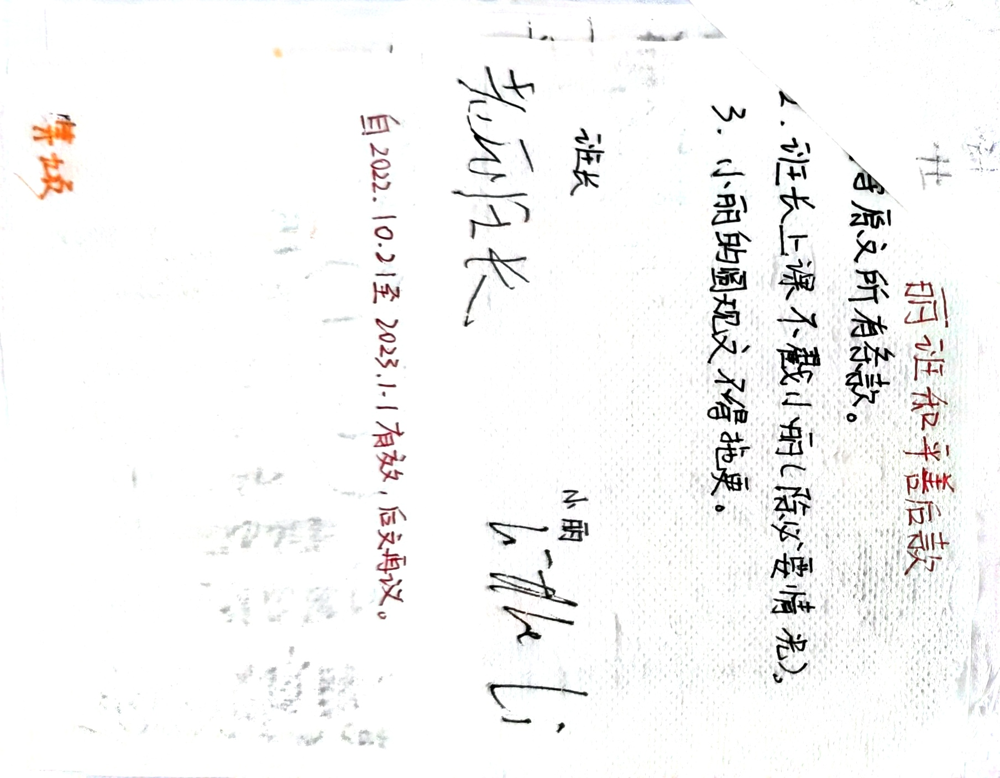

这是小丽与班长签署的《丽班和平条约》的善后章程，主要补充规定了没能完全执行的部分，并且延长了原协议的有效期。不过从这里也可以看出条约履行得并不顺畅。

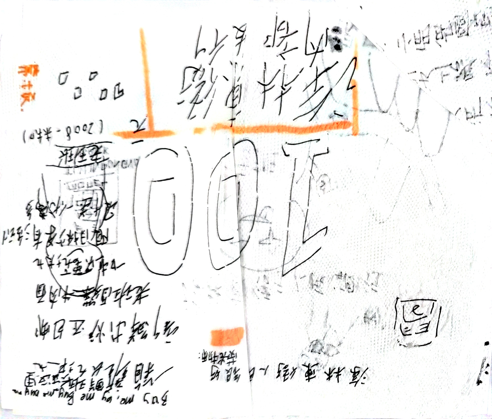

本作品作者无法确定，经过本人极其不严谨的分析，嫌疑人如下：

- 旺仔（字体相近）
- 庄总（右上角的宣传语是他写的）
- 小丽（这就不用解释了）

这是涂林币的早期版本，当然并没有大量印刷，但是它的价值在于右上角的卖班长的宣传语，后来在其他资料中没有再次发现。

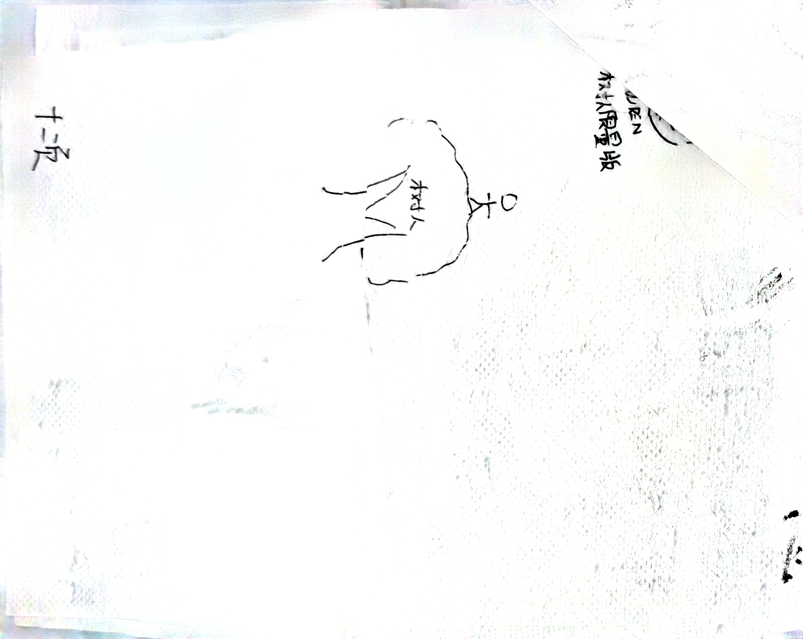

……

[^1]: 实际上这里不应该修改错字，因为我们伟大的鲁迅先生在《狂人日记》里也写的是「叶」。

[^2]: 我的意思是，把圆规拆下来然后在嘴里嚼。（好像还是很奇怪？）
